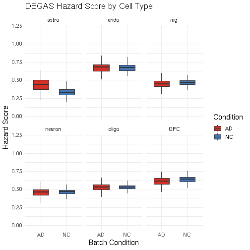
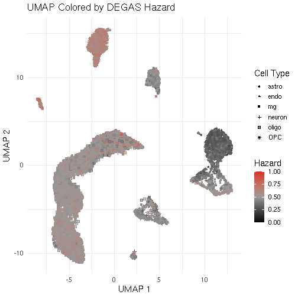

# Load required packages


``` r
library(Seurat)
library(reticulate)
library(dplyr)
library(magrittr)
library(ggplot2)
library(GGally)
library(stringr)
library(DESeq2)
library(DEGASv2)
library(rstatix)
library(Matrix)
library(ggpubr)
library(plotly)
```

# Load the scRNA-seq data


``` r
sc_raw_data <- read.csv("scDat.csv", header = TRUE, row.names = 1, sep = ",")
scMeta <- read.csv("scLab.csv", header = TRUE, row.names = 1, sep = ",")
```

# Load the patient data


``` r
bulk_dataset <- read.csv("patDat.csv", header = TRUE, row.names = 1)
patMeta <- read.csv("patLab.csv", header = TRUE, row.names = 1)
phenotype_df <- data.frame(CERAD = as.integer(patMeta$CERAD <= 2), 
                        Braak = as.integer(patMeta$Braak >= 5),
                        CDR = as.integer(patMeta$CDR) >= 3)
```

# Preprocessing data


``` r
# sc data only
umap_df <- umap_coordinate(sc_raw_data, scMeta)
# use CERAD for test
label = "CERAD"
data <- DEGAS_preprocessing(scst_list = sc_raw_data, sclab = scMeta$cellType, patdata = bulk_dataset, phenotype = phenotype_df[[label]], bulk_hvg = TRUE, bulk_de = TRUE, sc_de = TRUE, add_genes = NULL)
```

# Run DEGAS model


``` r
n_st_classes = length(unique(scMeta$cellType))

# Run DEGAS model
degas_sc_results <- run_DEGAS_SCST(data_list= data, model_type = "ClassClass",data_name = "Grubman_MSBB", loss_type = "cross_entropy", transfer_type  = "Wasserstein", model_save_dir = ".", tot_seeds = 10)
```

```
## unique patient labels: 0 1 
## range patient labels: 0 1 
## unique sc labels: 0 1 2 3 4 5 
## n_st_classes: 6 
## Run submodel 0...
## Load ClassClass model...
## save the configurations into ./fold_-1_random_seed_0/configs.json
## load models on cuda:0
## Run submodel 1...
## Load ClassClass model...
## save the configurations into ./fold_-1_random_seed_1/configs.json
## load models on cuda:0
## Run submodel 2...
## Load ClassClass model...
## save the configurations into ./fold_-1_random_seed_2/configs.json
## load models on cuda:0
## Run submodel 3...
## Load ClassClass model...
## save the configurations into ./fold_-1_random_seed_3/configs.json
## load models on cuda:0
## Run submodel 4...
## Load ClassClass model...
## save the configurations into ./fold_-1_random_seed_4/configs.json
## load models on cuda:0
## Run submodel 5...
## Load ClassClass model...
## save the configurations into ./fold_-1_random_seed_5/configs.json
## load models on cuda:0
## Run submodel 6...
## Load ClassClass model...
## save the configurations into ./fold_-1_random_seed_6/configs.json
## load models on cuda:0
## Run submodel 7...
## Load ClassClass model...
## save the configurations into ./fold_-1_random_seed_7/configs.json
## load models on cuda:0
## Run submodel 8...
## Load ClassClass model...
## save the configurations into ./fold_-1_random_seed_8/configs.json
## load models on cuda:0
## Run submodel 9...
## Load ClassClass model...
## save the configurations into ./fold_-1_random_seed_9/configs.json
## load models on cuda:0
## Finish Run and Eval all models
## Aggregate all results
```

``` r
hazard_df <- cbind(as.data.frame(degas_sc_results), scMeta, umap_df)
hazard_df <- hazard_df %>% mutate(batchCond = ifelse(batchCond == "AD", "AD", ifelse(batchCond == "ct", "NC", batchCond)))
write.csv(hazard_df, "results.csv", row.names = FALSE)
```

# Visualize the Result


``` r
boxplot_fig <- ggplot(hazard_df, aes(x = batchCond, y = hazard, fill = batchCond)) + 
  geom_boxplot(position = position_dodge(), width = 0.6, outlier.shape = NA) + 
  scale_fill_manual(values = c("AD" = "#D73027", "NC" = "#4575B4")) +
  ylim(0, 1.2) +
  facet_wrap(~cellType, nrow = 2) +
  labs(
    title = "DEGAS Hazard Score by Cell Type",
    x = "Batch Condition",
    y = "Hazard Score",
    fill = "Condition"
  ) +
  theme_minimal(base_size = 14)

umap_fig <- ggplot(hazard_df, aes(x = UMAP_1, y = UMAP_2, color = hazard, shape = cellType)) +
  geom_point(size = 1.4) +
  scale_color_gradient2(
    low = "#000000", mid = "#999999", high = "#D73027", midpoint = 0.5,
    limits = c(0, 1), name = "Hazard"
  ) +
  labs(
    title = "UMAP Colored by DEGAS Hazard",
    x = "UMAP 1",
    y = "UMAP 2",
    shape = "Cell Type"
  ) +
  theme_minimal(base_size = 14)

ggsave("figures/boxplot.png", boxplot_fig, width = 7, height = 5, dpi = 300)
ggsave("figures/umap.png", umap_fig, width = 7, height = 5, dpi = 300)

print(boxplot_fig)
```



``` r
print(umap_fig)
```


