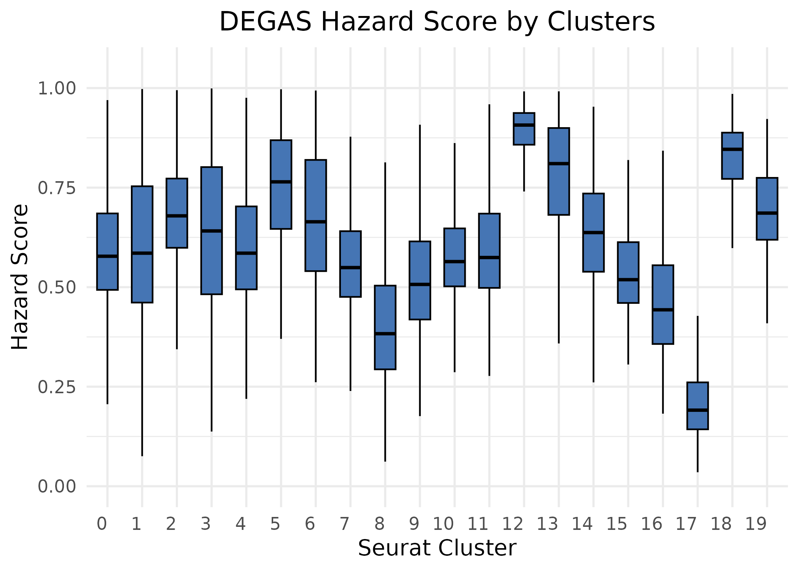
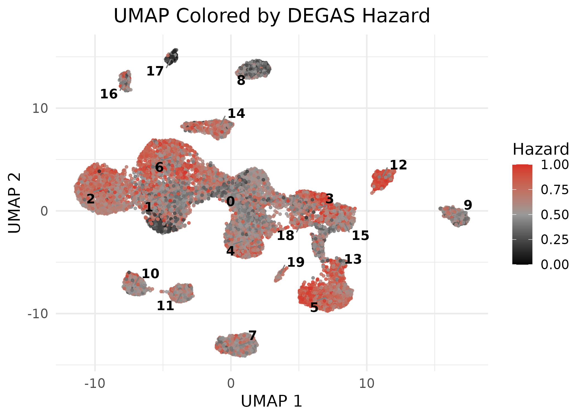

# Load required packages


``` r
library(ggrepel)
library(dplyr)
library(magrittr)
library(Seurat)
library(ggplot2)
library(stringr)
library(DESeq2)
library(DEGASv2)
library(ggpubr)
library(Matrix)
```

# Load the scRNA-seq data


``` r
sc_raw_data <- read.csv("scDat.csv", header = TRUE, row.names = 1, sep = ",")
scMeta <- read.csv("scLab.csv", header = TRUE, row.names = 1, sep = ",")
```

# Load the patient data


``` r
bulk_dataset <- read.csv("patDat.csv", header = TRUE, row.names = 1)
patMeta <- read.csv("patLab.csv", header = TRUE, row.names = 1)
```

# Preprocessing data


``` r
# sc data only
umap_df <- umap_coordinate(sc_raw_data, scMeta, dims = 1:5, resolution = 0.3)
# use CERAD for test
label = "responder"
data <- DEGAS_preprocessing(scst_list = sc_raw_data, sclab = scMeta$seurat_clusters, patdata = bulk_dataset, phenotype = patMeta[[label]], bulk_hvg = TRUE, bulk_de = TRUE, sc_de = TRUE, add_genes = NULL)
```

# Run DEGAS model


``` r
n_st_classes = length(unique(scMeta$seurat_clusters))

# Run DEGAS model
degas_sc_results <- run_DEGAS_SCST(data_list= data, model_type = "ClassClass",data_name = "MMRF", loss_type = "cross_entropy", transfer_type  = "Wasserstein", model_save_dir = ".", tot_seeds = 10)
```

```
## unique patient labels: 0 1 
## range patient labels: 0 1 
## unique sc labels: 0 1 2 3 4 5 6 7 8 9 10 11 12 13 14 15 16 17 18 19 
## n_st_classes: 20 
## Run submodel 0...
## Load ClassClass model...
## save the configurations into ./fold_-1_random_seed_0/configs.json
## load models on cuda:0
## Run submodel 1...
## Load ClassClass model...
## save the configurations into ./fold_-1_random_seed_1/configs.json
## load models on cuda:0
## Run submodel 2...
## Load ClassClass model...
## save the configurations into ./fold_-1_random_seed_2/configs.json
## load models on cuda:0
## Run submodel 3...
## Load ClassClass model...
## save the configurations into ./fold_-1_random_seed_3/configs.json
## load models on cuda:0
## Run submodel 4...
## Load ClassClass model...
## save the configurations into ./fold_-1_random_seed_4/configs.json
## load models on cuda:0
## Run submodel 5...
## Load ClassClass model...
## save the configurations into ./fold_-1_random_seed_5/configs.json
## load models on cuda:0
## Run submodel 6...
## Load ClassClass model...
## save the configurations into ./fold_-1_random_seed_6/configs.json
## load models on cuda:0
## Run submodel 7...
## Load ClassClass model...
## save the configurations into ./fold_-1_random_seed_7/configs.json
## load models on cuda:0
## Run submodel 8...
## Load ClassClass model...
## save the configurations into ./fold_-1_random_seed_8/configs.json
## load models on cuda:0
## Run submodel 9...
## Load ClassClass model...
## save the configurations into ./fold_-1_random_seed_9/configs.json
## load models on cuda:0
## Finish Run and Eval all models
## Aggregate all results
```

``` r
hazard_df <- cbind(as.data.frame(degas_sc_results), scMeta, umap_df)
write.csv(hazard_df, "results.csv", row.names = FALSE)
```

# Visualize the Result


``` r
boxplot_fig <- ggplot(hazard_df, aes(x = as.factor(seurat_clusters), y = hazard)) + 
  geom_boxplot(fill = "#4575B4", color = "black", width = 0.6, outlier.shape = NA) +
  ylim(0, 1.05) +
  labs(
    title = "DEGAS Hazard Score by Clusters",
    x = "Seurat Cluster",
    y = "Hazard Score"
  ) +
  theme_minimal(base_size = 14) +
  theme(
    axis.text.x = element_text(hjust = 1),
    plot.title = element_text(hjust = 0.5)
  )

cluster_centers <- hazard_df %>%
  group_by(seurat_clusters) %>%
  summarise(
    UMAP_1 = median(UMAP_1, na.rm = TRUE),
    UMAP_2 = median(UMAP_2, na.rm = TRUE)
  )

umap_fig <- ggplot(hazard_df, aes(x = UMAP_1, y = UMAP_2, color = hazard)) +
  geom_point(size = 0.8, alpha = 0.8) +  
  scale_color_gradient2(
    low = "#000000", mid = "#999999", high = "#D73027",
    midpoint = 0.5, limits = c(0, 1), name = "Hazard"
  ) +

  geom_text_repel(
    data = cluster_centers,
    aes(label = seurat_clusters),
    color = "black",
    size = 4,
    fontface = "bold",
    box.padding = 0.4,
    segment.color = "grey50"
  ) +
  labs(
    title = "UMAP Colored by DEGAS Hazard",
    x = "UMAP 1",
    y = "UMAP 2"
  ) +
  theme_minimal(base_size = 14) +
  theme(
    plot.title = element_text(hjust = 0.5),
    legend.position = "right"
  )


ggsave("figures/boxplot.png", boxplot_fig, width = 7, height = 5, dpi = 300)
ggsave("figures/umap.png", umap_fig, width = 7, height = 5, dpi = 300)

```



