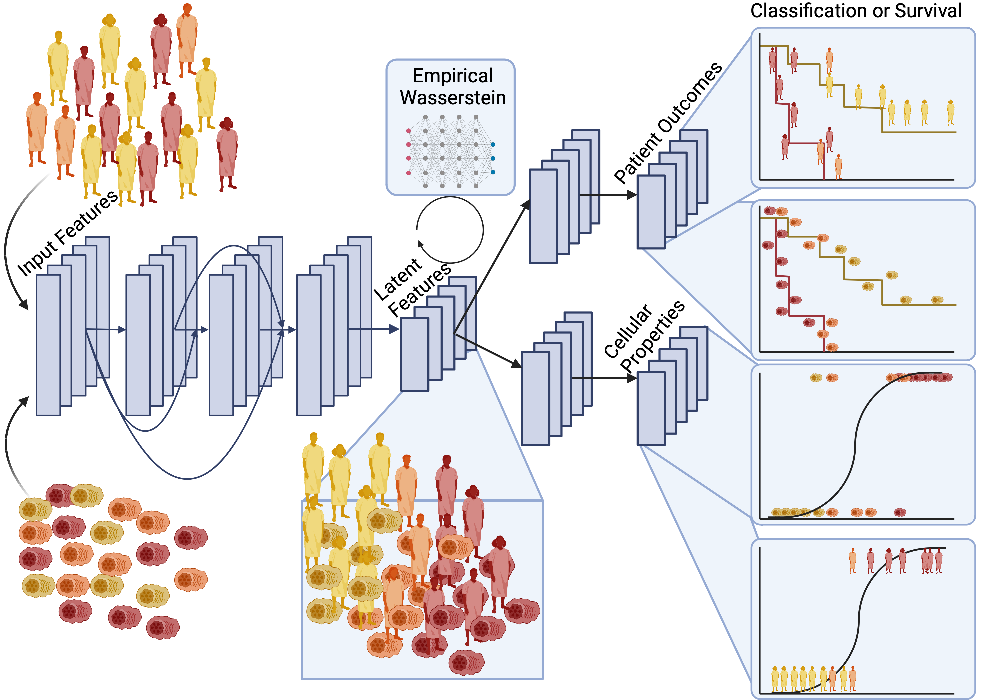

## Diagnostic Evidence GAuge of Single cells (DEGAS) version 2



**Package development by:**

**Ziyu Liu**

**Travis S. Johnson (https://github.com/tsteelejohnson91)**

**Sihong Li (https://github.com/alanli97)**

**Jiahui Liu (https://github.com/ElliotLiu1997)**

## Installation

### R
```R
install.packages("devtools")
devtools::install_github("ElliotLiu1997/DEGASv2", subdir = "DEGAS_R")
```

### Python
```bash
pip install git+https://github.com/ElliotLiu1997/DEGASv2.git#subdirectory=DEGAS_python
```

## **Prerequisites**

**Python packages**

pytorch

numpy

pandas

scipy

tqdm

scikit-learn

**R**

reticulate

Seurat

ggplot2

DESeq2
