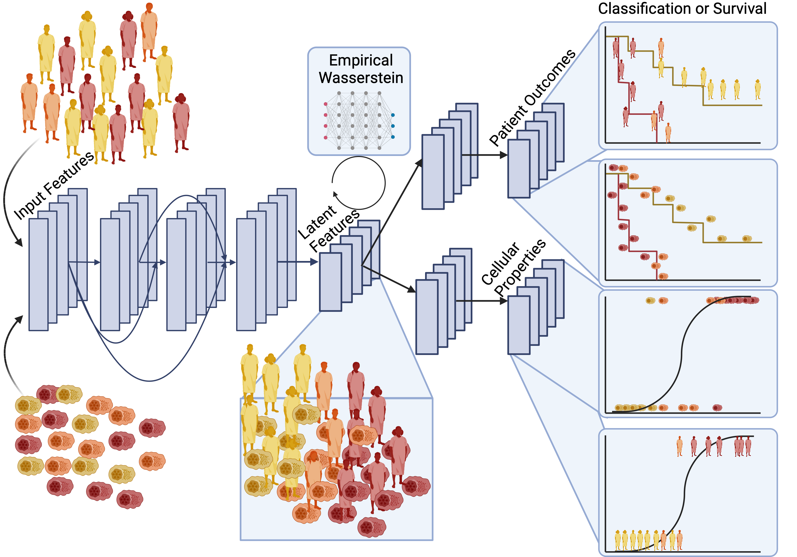

## Diagnostic Evidence GAuge of Single cells (DEGAS) version 2



**Package development by:**

**Ziyu Liu**

**Travis S. Johnson (https://github.com/tsteelejohnson91)**

**Sihong Li (https://github.com/alanli97)**

**Jiahui Liu (https://github.com/ElliotLiu1997)**

## Installation

### R
```R
install.packages("devtools")
devtools::install_github("ElliotLiu1997/DEGASv2", subdir = "DEGAS_R")
```

&#9888;&#65039; Note: The folder `DEGAS_R_old` contains archived code for internal reference only.  
Do **NOT** install from that folder.

### Python
```bash
pip install git+https://github.com/ElliotLiu1997/DEGASv2.git#subdirectory=DEGAS_python
```

## **Prerequisites**

**Python packages**

pytorch

numpy

pandas

scipy

tqdm

scikit-learn

## Patient-level out-of-fold diagnostics

The Python bagging entry point can optionally hold out complete patient groups
(for example, source studies) and record calibration diagnostics. Legacy calls
are unchanged. Enable the new path with `patient_oof=True` and pass a group and
identifier for every patient:

```python
options["patient_oof"] = True
options["calibration_penalty"] = 1.0
options["calibration_bins"] = 5

cell_results = DEGAS_python.bagging_all_results(
    options,
    patient_expression,
    patient_labels,
    cell_expression,
    sc_lab_mat=cell_labels,
    pat_groups=patient_study,
    pat_ids=patient_ids,
)
```

Each submodel is trained without the complete held-out group. DEGAS writes raw
submodel predictions, one bagged out-of-fold score per patient, cross-fitted
ridge-logistic probabilities, discrimination and Brier metrics, reliability
bins, fold-specific calibration parameters, and a deployment calibrator. Apply
the deployment calibrator only after averaging a matching ensemble. Cellular
DEGAS scores are not patient disease probabilities and are not calibrated by
this procedure.

**R**

reticulate

Seurat

ggplot2

DESeq2


## Optional Scanpy marker backend

The R package can use Scanpy for the marker-testing step in native feature
selection. Seurat normalization, PCA, neighbors and clustering are unchanged.
Existing calls continue to use `Seurat::FindAllMarkers`.

After installing the updated `DEGAS_R` package, create a separate Python 3.11
virtual environment and install the requirements shipped in
`DEGAS_R/inst/python/requirements-scanpy.txt`:

```sh
python3.11 -m venv ~/.venvs/degas-scanpy
~/.venvs/degas-scanpy/bin/python -m pip install -r DEGAS_R/inst/python/requirements-scanpy.txt
```

```r
library(DEGASv2)
Sys.setenv(DEGAS_SCANPY_PYTHON = path.expand("~/.venvs/degas-scanpy/bin/python"))
selected <- select_genes(scdata, sclab, patdata, phenotype,
                         sc_marker_fun = FindAllMarkersScanpy)
# Or pass sc_marker_fun = FindAllMarkersScanpy to DEGAS_preprocessing().
```

`FindAllMarkersScanpy()` can also be called on a normalized, clustered Seurat
object directly. Its `directory` argument retains binary exchange files,
`markers.csv`, and timing/version metadata; by default it uses an R temporary
directory. The adapter requires Seurat 5's `layer` API. Python runs in a separate
process; no reticulate configuration is needed. Sparse expression is preserved
until normalization of selected genes.

The adapter keeps Seurat fold changes and detection fractions, both marker
signs, minimum detection .25, absolute log2 fold change .25, raw p < .01,
and assay-wide Bonferroni correction. DEGAS still globally ranks marker rows by
adjusted p ascending then signed fold change descending, truncates to 200 rows,
and deduplicates before union with 250 bulk variability and 250 bulk-DE picks.
These are source quotas, not guaranteed unique counts or per-cluster quotas.

Scanpy is pinned to 1.10.4: a private tie-correction cache avoids recomputing an
identical rank-block correction for every cluster. It is scoped to the standalone
Python call and restored on errors. `find_markers(..., cache_ties=False)` disables
it for programmatic use; do not use the cache concurrently in one Python process.
Tests compare cached and uncached outputs exactly. Seurat and Scanpy p-values
can differ because of continuity/exact-test behavior and numerical ties; this
is not a bitwise-equivalence claim. Globally selected markers need not cover all
cell types evenly.

Validation scripts (after package installation):

```sh
Rscript DEGAS_R/tests/scanpy/test_bridge.R DEGAS_R ~/.venvs/degas-scanpy/bin/python /tmp/degas-marker-test
PYTHONPATH=DEGAS_R/inst/python ~/.venvs/degas-scanpy/bin/python DEGAS_R/tests/scanpy/test_tie_cache.py /tmp/degas-marker-test
```

The T2D full-data trial used 221,551 cells and 16,561 genes. The Python marker
stage took 862.45 seconds (including transfer-file loading/writing, excluding
Seurat preprocessing and R export); default source quotas yielded 666 unique
genes. Runtime is dataset/environment dependent, not a paired speedup benchmark.

## Validation, gene-set-size ensembles, evaluation plots and SHAP

The [runnable Python tutorial](examples/validation/README.md) covers raw-count
preprocessing, DEGAS training, selectable **study-level or patient-level** folds,
a default 10% patient holdout (or at least one whole study), and native AUROC /
five-metric plots. It selects all gene-set sizes within one bootstrap SE of the
best validation AUROC, then averages their per-size DEGAS percentile ranks.
Final holdout evaluation is kept separate from size selection.

[Direct SHAP](DIRECT_SHAP.md) explains DEGAS class probabilities through the
trained network, without a surrogate. Both features are optional; existing R
and Python training calls continue to work.
