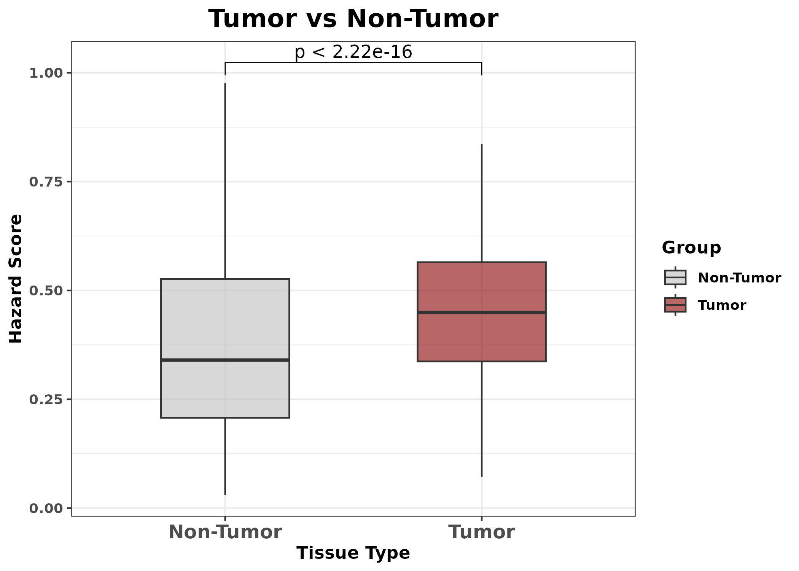
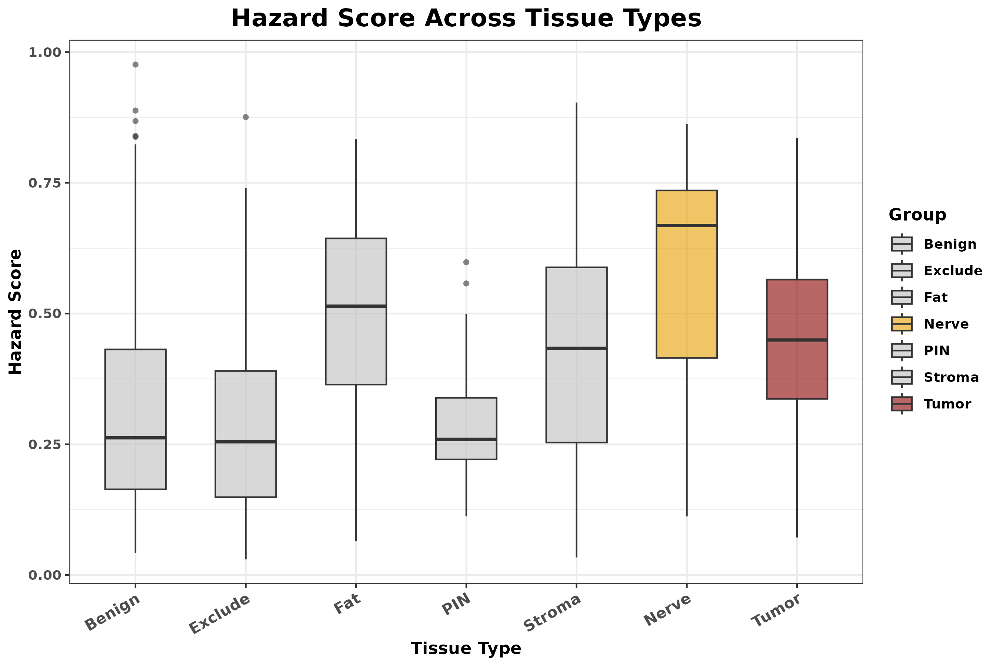
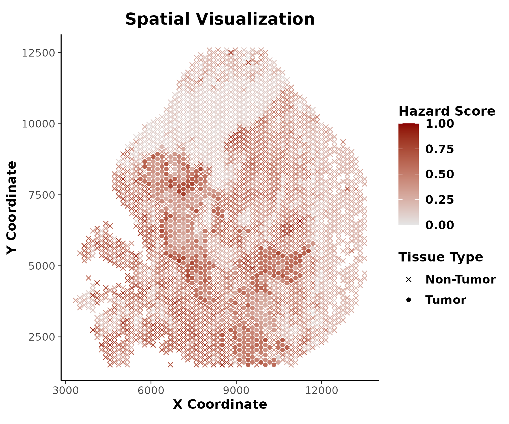

# Load required packages

``` r
library(ggplot2)
library(reticulate)
library(dplyr)
library(magrittr)
library(Seurat)
library(stringr)
library(DESeq2)
library(DEGASv2)
library(ggpubr)
```

# Load the ST data

``` r
h5_data <- Read10X_h5(paste0(root_dir, "/H2_1/filtered_feature_bc_matrix.h5"))
spatial_loc <- read.csv(paste0(root_dir, "/H2_1/tissue_positions_list.csv"), header = FALSE)[, c(1, 5, 6)]
rownames(spatial_loc) <- spatial_loc$V1
spatial_loc <- spatial_loc[, c(2, 3)]
barcodes <- intersect(colnames(h5_data), rownames(spatial_loc))
h5_data <- h5_data[, barcodes]
spatial_loc <- spatial_loc[barcodes, ]
colnames(spatial_loc) <- c("coord1", "coord2")
Meta <- read.csv(paste0(root_dir, "/H2_1/H2_1_Final_Consensus_Annotations.csv"), row.names = 1)
```

# Load the patient data

``` r
bulk_dataset <- read.csv("PatDat.csv", row.names = 1)
phenotype <- read.csv("PatLab.csv", row.names = 1)
```

# Preprocessing data

``` r
data <- DEGAS_preprocessing(scst_list = h5_data, sclab = Meta$Final_Annotations, patdata = bulk_dataset, phenotype = phenotype, bulk_hvg = TRUE, bulk_de = TRUE, sc_de = TRUE, add_genes = NULL, model_type = "survival")
```

# Run DEGAS model

``` r
n_st_classes = length(unique(Meta$Final_Annotations))

# Run DEGAS model
degas_st_results <- run_DEGAS_SCST(data_list= data, model_type = "BlankCox",data_name = "spatial", loss_type = "rank_loss", transfer_type  = "Wasserstein", model_save_dir = ".", tot_seeds = 10)
```

    ## Run submodel 0...
    ## Load BlankCox model...
    ## save the configurations into ./fold_-1_random_seed_0/configs.json
    ## load models on cuda:0
    ## Run submodel 1...
    ## Load BlankCox model...
    ## save the configurations into ./fold_-1_random_seed_1/configs.json
    ## load models on cuda:0
    ## Run submodel 2...
    ## Load BlankCox model...
    ## save the configurations into ./fold_-1_random_seed_2/configs.json
    ## load models on cuda:0
    ## Run submodel 3...
    ## Load BlankCox model...
    ## save the configurations into ./fold_-1_random_seed_3/configs.json
    ## load models on cuda:0
    ## Run submodel 4...
    ## Load BlankCox model...
    ## save the configurations into ./fold_-1_random_seed_4/configs.json
    ## load models on cuda:0
    ## Run submodel 5...
    ## Load BlankCox model...
    ## save the configurations into ./fold_-1_random_seed_5/configs.json
    ## load models on cuda:0
    ## Run submodel 6...
    ## Load BlankCox model...
    ## save the configurations into ./fold_-1_random_seed_6/configs.json
    ## load models on cuda:0
    ## Run submodel 7...
    ## Load BlankCox model...
    ## save the configurations into ./fold_-1_random_seed_7/configs.json
    ## load models on cuda:0
    ## Run submodel 8...
    ## Load BlankCox model...
    ## save the configurations into ./fold_-1_random_seed_8/configs.json
    ## load models on cuda:0
    ## Run submodel 9...
    ## Load BlankCox model...
    ## save the configurations into ./fold_-1_random_seed_9/configs.json
    ## load models on cuda:0
    ## Finish Run and Eval all models
    ## Aggregate all results

``` r
hazard_df <- cbind(as.data.frame(degas_st_results), Meta, spatial_loc)
hazard_df2 <- hazard_df[hazard_df$Final_Annotations != "", ]

# define tumor and non-tumor
hazard_df2 <- hazard_df2 %>%
  mutate(TumorStatus = case_when(
    Final_Annotations %in% c("GG2", "GG4") ~ "Tumor",
    TRUE ~ "Non-Tumor"
  ))

write.csv(hazard_df2, "results.csv", row.names = FALSE)
```

# Visualize the Result

### 1. Tumor vs Non-Tumor

``` r
x_axis_order <- c("Non-Tumor", "Tumor")
colors <- c("Non-Tumor" = "gray", "Tumor" = "darkred")
my_comparisons <- list(c("Non-Tumor", "Tumor"))

p1 <- ggplot(hazard_df2, aes(x = factor(TumorStatus, levels = x_axis_order), y = hazard)) +
  geom_boxplot(aes(fill = TumorStatus), alpha = 0.6, width = 0.5, outlier.shape = 16, outlier.size = 1.5) +
  # geom_jitter(width = 0.2, alpha = 0.4, color = "black") +  
  labs(
    title = "Tumor vs Non-Tumor",
    x = "Tissue Type",
    y = "Hazard Score",
    fill = "Group"
  ) +
  theme_bw() +
  theme(
    axis.text.x = element_text(angle = 0, hjust = 0.5, face = "bold", size = 12),
    axis.text.y = element_text(face = "bold"),
    text = element_text(face = "bold"),
    plot.title = element_text(size = 16, face = "bold", hjust = 0.5)
  ) +
  scale_fill_manual(values = colors) +
  stat_compare_means(
    comparisons = my_comparisons,
    label = "p.format",  
    size = 4
  )

ggsave("figures/box_Tumor_vs_NonTumor.png", p1, width = 7, height = 5, dpi = 300)
```


### 2. Zoom Out Non-Tumor Regions

``` r
hazard_df3 <- hazard_df2 %>%
  mutate(Final_Annotations = case_when(
    Final_Annotations %in% c("GG2", "GG4") ~ "Tumor",
    TRUE ~ Final_Annotations
  ))

x_axis_order <- c("Benign", "Exclude", "Fat", "PIN", "Stroma", "Nerve", "Tumor")
colors <- c(
  "Benign" = "gray",
  "Exclude" = "gray",
  "Fat" = "gray",
  "PIN" = "gray",
  "Stroma" = "gray",
  "Nerve" = "#E69F00",
  "Tumor" = "darkred"
)

p2 <- ggplot(hazard_df3, aes(x = factor(Final_Annotations, levels = x_axis_order), y = hazard)) +
  geom_boxplot(aes(fill = Final_Annotations), alpha = 0.6, width = 0.55, outlier.shape = 16, outlier.size = 1.5) +
  labs(
    title = "Hazard Score Across Tissue Types",
    x = "Tissue Type",
    y = "Hazard Score",
    fill = "Group"
  ) +
  theme_bw() +
  theme(
    axis.text.x = element_text(angle = 30, hjust = 1, face = "bold", size = 10),
    axis.text.y = element_text(face = "bold"),
    text = element_text(face = "bold"),
    plot.title = element_text(size = 16, face = "bold", hjust = 0.5)
  ) +
  scale_fill_manual(values = colors)

ggsave("figures/box_Hazard_TissueTypes_TumorMerged.png", p2, width = 9, height = 6,dpi = 300)
```


### 3. Spatial Visualization

``` r
p3 <- ggplot(hazard_df2, aes(x = coord1, y = coord2)) +
  geom_point(aes(color = hazard, shape = TumorStatus)) +
  scale_color_gradient(low = "gray90", high = "darkred", limits = c(0, 1)) +
  scale_shape_manual(values = c("Non-Tumor" = 4, "Tumor" = 16)) +
  coord_fixed() + 
  labs(
    title = "Spatial Visualization",
    x = "X Coordinate",
    y = "Y Coordinate",
    color = "Hazard Score",
    shape = "Tissue Type"
  ) +
  theme_bw() +
  theme(
    plot.title = element_text(face = "bold", size = 14, hjust = 0.5),
    legend.title = element_text(face = "bold", size = 11),
    legend.text = element_text(face = "bold", size = 10),
    axis.title = element_text(face = "bold", size = 11),
    axis.text = element_text(size = 9),
    axis.ticks = element_line(linewidth = 0.3),
    axis.line = element_line(linewidth = 0.4, colour = "black"),
    panel.border = element_blank(),   
    panel.grid = element_blank()      
  )

ggsave("figures/spatial_hazard.png", p3, width = 6, height = 5, dpi = 300)
```


