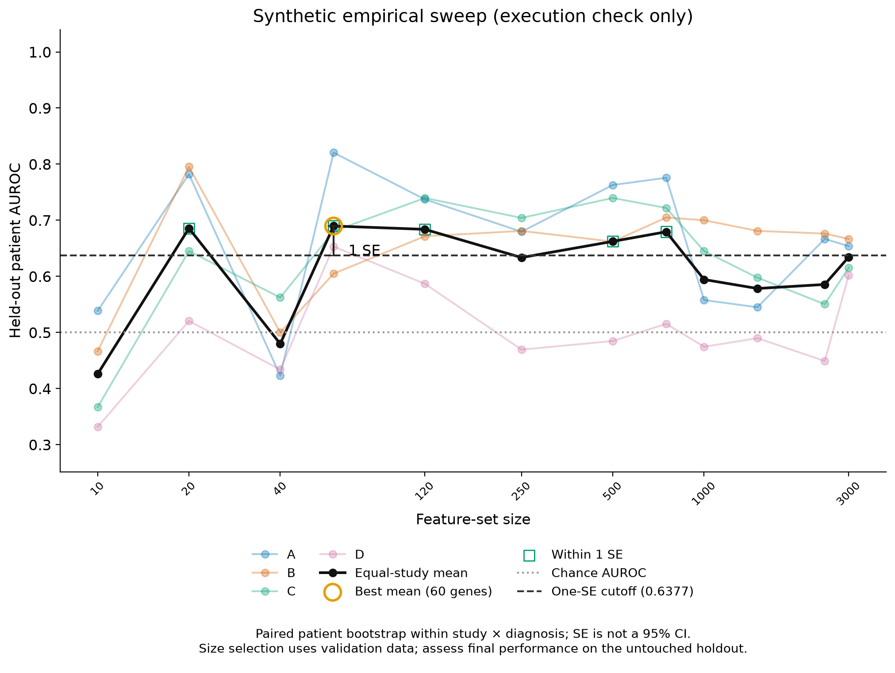
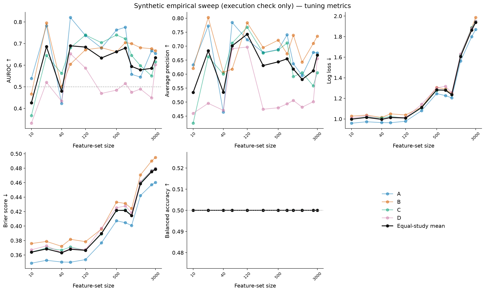

# User-defined features or empirical size selection

DEGAS supports two workflows: evaluate a gene list or variable-gene counts you
choose, or search a broad size grid and derive the retained sizes from validation.
**Both use the same patient splits, performance metrics, plots, one-SE rule and
final holdout evaluation.** Run locally or distribute the same tasks with SLURM.
This tutorial uses the binary `BlankClass` backend; class 1 is the outcome of
interest. Survival models need a different evaluation design.

Install from the repository root into a Python environment with PyTorch support:

```bash
python -m pip install -e './DEGAS_python[validation,explain]'
```

## 1. User-defined feature set & sizes

**An exact gene list:** put one unique gene ID per line in a plain text file,
without a header. DEGAS preserves this order and uses the complete list in every
fold. Every gene must be measured in both bulk and reference-cell data; missing
or duplicate genes cause an error, not silent removal or zero filling.

```bash
python examples/validation/run.py --input data/my_cohort \
  --output runs/my_gene_list --genes my_genes.txt --split patient
```

Use a prespecified list derived independently of these validation/test outcomes.
Supplying a list selected using all patients' labels would leak information;
this workflow cannot undo that prior selection. One gene list per run is supported.
Its single point appears in the same AUROC and five-metric figures; this evaluates
the set, but does not empirically determine a size from alternative candidates.

**One or more highly variable gene counts:** ask for the top N training-bulk
variable genes, with no requirement that N be small:

```bash
python examples/validation/run.py --input data/my_cohort \
  --output runs/my_hvg_counts --sizes 500 1500 5000 10000 --split study
```

The selector ranks variance of `log1p(raw counts)` across training bulk patients.
It is recomputed inside each validation fold and on development patients for the
final models. Gene membership can change across folds. This is a simple,
explicit HVG definition, not the R marker selector or the study-residualized
logCPM selector used in the T2D analysis. For custom selection methods, adapt the
training-only ranking in `sweep.prepare()` and create a new run. A requested
count larger than the measured bulk/cell intersection fails explicitly.

`--genes` and `--sizes` are mutually exclusive. If neither is given in user mode,
the small synthetic-example defaults are 10, 20 and 40; specify your intended
counts for real data. **There is no 40- or 120-gene limit.**

## 2. Empirically-derived feature set size

T2D results motivated testing thousands of genes; they do not prescribe the best
size for another cohort. Empirical mode needs no manually supplied size list:

```bash
python examples/validation/run.py --input data/my_cohort \
  --output runs/empirical_local --feature-mode empirical --split study
```

The default candidate grid is:

```text
10, 20, 40, 60, 120, 250, 500, 750, 1000, 1500, 2500, 5000, 7500, 10000
```

Values above the measured shared-gene count are omitted, and that full count is
added as the final candidate. With 16,561 shared genes, 16,561 is included;
with a 337-gene panel, the search ends at 337. `--max-genes 5000` optionally caps
the search budget and includes that endpoint. `--sizes ...` can override the
empirical grid if a different prespecified search is appropriate.

The workflow ranks training-only HVGs separately for each fold, evaluates every
candidate, and retains **all sizes within one bootstrap SE of the best mean
AUROC**. Average seeds within size, rank scores within size, then average ranks
across retained sizes. This is empirical selection among a finite grid, not a
claim to have found the globally optimal gene subset. If validation performance
is still rising at the largest allowed size, report that search-boundary limit.

### Parallel training and pooling with SLURM

The installed module provides `prepare`, `worker`, `collect`, `status` and
`submit`. **One task = one validation fold × candidate size × model seed.**
For three development folds, 15 candidates and five seeds, this is 225
independent training jobs. Final training uses only the retained sizes × seeds.

1. On a shared filesystem visible to compute nodes, prepare once. This converts
   the input CSVs to memory-mapped arrays, reserves the final holdout, freezes
   gene lists and split membership, and writes the task manifest. Preparation
   reads dense CSV matrices into memory: run it in a CPU allocation with adequate
   RAM for large inputs, not on a constrained login node.

   ```bash
   python -m DEGAS_python.sweep prepare --input data/my_cohort \
     --output runs/empirical_cluster --feature-mode empirical --split study \
     --seeds 5 --shap
   ```

2. Submit validation tasks plus a CPU pooling job. Replace the account and
   partition names with your site's settings. `--parallel 8` limits concurrent
   array tasks; resources apply **per task**. `--dry-run` prints the commands
   without submitting them; remove it to submit.

   ```bash
   python -m DEGAS_python.sweep submit --run runs/empirical_cluster \
     --phase validation --account YOUR_ACCOUNT --partition GPU_PARTITION \
     --gpus 1 --cpus 2 --mem 32G --time 04:00:00 --parallel 8 \
     --pool-partition CPU_PARTITION --pool-mem 16G --pool-time 01:00:00 \
     --dry-run
   ```

   Omit `--gpus 1` for CPU training. The submitter uses the current Python
   executable; `--python /shared/env/bin/python` can select another installed
   environment. The environment, checkout and prepared run must be accessible
   on every node. Site-specific module loading, GPU availability and scheduling
   limits remain your cluster's configuration. Memory/time defaults are starting
   points, not estimates for arbitrary datasets: pilot the largest size first.

3. The pooling job has an `afterok` dependency on the **entire array**. It checks
   all expected tasks, patient IDs, seeds, gene lists, configuration and result
   hashes before averaging seeds. Partial runs never choose a winner. It writes
   `reports/validation/auroc_selection.{png,pdf}`,
   `reports/validation/evaluation_metrics.{png,pdf}`, supporting CSVs, and
   `final_tasks.json` for retained sizes only.

4. After validation pooling completes, submit the retained final models and
   their pooling job. These models train on development patients only and
   predict the untouched holdout. They do not use holdout labels to reselect sizes.

   ```bash
   python -m DEGAS_python.sweep submit --run runs/empirical_cluster \
     --phase final --account YOUR_ACCOUNT --partition GPU_PARTITION \
     --gpus 1 --cpus 2 --mem 32G --time 04:00:00 --parallel 8 \
     --pool-partition CPU_PARTITION --pool-mem 16G
   ```

   Final raw/average-rank scores and holdout metrics appear in `reports/final/`.
   Once final pooling finishes, runs prepared with `--shap` can submit explanations:

   ```bash
   python -m DEGAS_python.sweep submit --run runs/empirical_cluster \
     --phase explain --account YOUR_ACCOUNT --partition GPU_PARTITION \
     --gpus 1 --cpus 2 --mem 32G --time 04:00:00 --parallel 8 \
     --pool-partition CPU_PARTITION --pool-mem 16G
   ```

   This uses one job per retained model, with resumable cell chunks.
   Seed-mean explanations appear in `reports/explain/`. User-defined lists or sizes use this same
   SLURM procedure: replace the `prepare` feature arguments with `--genes` or
   `--sizes`. Both modes always make the same validation figures.

The generated `slurm/worker.sh` and `slurm/pool.sh`, submission commands/job IDs,
and `logs/` are retained. Array concurrency and dependency behavior follow the
[SLURM array documentation](https://slurm.schedmd.com/job_array.html) and
[sbatch reference](https://slurm.schedmd.com/sbatch.html). No cluster jobs are
submitted by `prepare`, the local runner, or `submit --dry-run`.

### Failed tasks, retries and manual pooling

```bash
python -m DEGAS_python.sweep status --run runs/empirical_cluster --phase validation
python -m DEGAS_python.sweep worker --run runs/empirical_cluster --phase validation --task-id 7
python -m DEGAS_python.sweep collect --run runs/empirical_cluster --phase validation
```

`status` lists incomplete IDs. Calling `submit` again submits only incomplete
tasks and creates a new dependent pooling job; `collect` still requires the
whole manifest. If an array fails, its now-impossible dependent pooling job is
cancelled (`--kill-on-invalid-dep=yes`); rerunning `submit` creates a new one.
A completed task is verified and skipped on retry. Failed
attempt directories are retained separately, and only an atomically published
`complete.json` marks success. After confirming that a failed attempt is no
longer running, its large scratch matrices may be removed to recover disk space.

Do not edit prepared inputs, feature lists, source code or settings mid-run.
Changes require a new output directory. Source/input/result hashes reject mixed
runs; successful checkpoints/results are preserved. Pooling is idempotent. If
an array was submitted but submission of its pooling job failed, its recorded
job ID remains in `slurm/submission_*.json`; after it finishes, call `collect`.

## Input data, preprocessing and split design (both workflows)

Each `--input` directory contains:

| File | Contents |
|---|---|
| `bulk_counts.csv` | Rows = patients; columns = unique gene IDs; first column = patient ID. |
| `patients.csv` | `patient_id,study,label`; one row per patient, binary outcome 0/1. |
| `cell_counts.csv` | Rows = cells; columns = unique gene IDs; first column = cell ID. |
| `cells.csv` | `cell_id,patient_id`; known donor ID for every reference cell. |

Use globally unique patient IDs across studies/assays. Bulk rows are joined by
ID. The example requires an independent cell-reference cohort and rejects
bulk/cell donor overlap. If cohorts overlap, implement fold-specific reference
cell exclusions too. Unknown donor identity cannot establish independence.
Technical replicates must be aggregated to one score per patient for evaluation.

`--split study` reserves `ceil(holdout_fraction × number_of_studies)` whole
studies (at least one), then performs leave-one-study-out validation among the
remaining studies. This requires at least three studies. With unequal sizes,
the holdout need not contain 10% of patients.

`--split patient` reserves approximately 10% of unique patients, stratified by
outcome, then uses stratified patient K-fold validation (`--folds 5`). Studies
may appear in both partitions: this estimates within-cohort generalization,
not transfer to an unseen study. Use it with few/unequal studies, including a
single study. Set `--holdout-fraction` and `--seed` before inspecting performance.
Both modes require both outcomes in every training/validation split, and at
least two development patients per study/outcome for bootstrap SE.

After choosing genes, `preprocess_counts` transforms each row **across those
selected genes** using `normalize_scale(1.5 ** log2(counts + 1))`. Do not normalize
the complete gene universe and then subset. R genes-by-samples matrices must be
transposed. The CSV workflow expects raw, finite, nonnegative counts; the API
separately supports `already_log=True` for actual log2(count+1) inputs. Never
zero-fill unmeasured genes. Learned batch correction or supervised feature
selection belongs inside training folds.

Workers use memory-mapped raw matrices and normalize selected genes in chunks.
They create per-attempt normalized matrices on shared disk and remove these
scratch files after successful training. Size disk and memory for the largest
candidate and concurrent tasks; final checkpoints, outputs and SHAP are retained.
Only a small reference-cell subset is evaluated during training; final workers
score the full reference in batches. The complete cell reference still trains
all models. `tot_folds=1, fold=-1` disable the older cell-subsampling mechanism;
patient splits are explicit, independent of that option.

## Shared evaluation, one-SE selection and rank scores

For each patient/size, average seed probabilities, then compute metrics per
study. Use **equal-study mean AUROC**, even when folds split patients. The
bootstrap resamples patients within study × outcome, pairing resamples across
sizes. With `best = argmax(mean_AUROC)`, retain every size satisfying
`mean_AUROC >= mean_AUROC[best] - SE[best]`; smallest size breaks an exact best-mean
tie. Default bootstrap count is 20,000 (`--bootstrap`). SE is conditional on
fitted models and observed studies; it is not a 95% CI or an estimate of all
training/study-population uncertainty.

This ensemble rule retains all eligible sizes, rather than selecting only the
smallest. Seeds are averaged **before** average-tie rank/N within each size;
those ranks are averaged across retained sizes with no final re-ranking. For
cells, the reference is all supplied cells across donors/types. Test patients
are ranked separately across the entire holdout cohort. The reference population
must be declared because adding observations changes ranks.

The native plots follow `SC_plotting_starter.R`: faint study curves, a black
equal-study mean, best-size ring, one-SE cutoff/marker and retained-size symbols,
plus panels for AUROC, average precision, log loss, Brier score and balanced
accuracy (threshold 0.5). All five metrics use raw probabilities. The final rank
ensemble is not a calibrated probability, so its report includes AUROC and
average precision only; per-size raw probabilities retain all five metrics.
Broad and panel-intersection universes require separate runs/cutoffs. Bulk
patient performance does not validate cellular diagnosis or spatial biology.

For externally produced OOF predictions, the same plotting API remains available:

```python
from DEGAS_python.validation import select_one_se
from DEGAS_python.evaluation_plots import plot_validation

# Columns: patient_id, study, label, size, score; one seed-mean score/patient/size.
metrics, selection = select_one_se(predictions, n_bootstrap=20000, seed=42)
figures = plot_validation(metrics, selection, output_dir='figures/my_cohort')
```

## Direct SHAP and outputs

Add `--shap` when preparing a run to explain final models. See the
[direct SHAP guide](../../DIRECT_SHAP.md). Every seed uses the same
background cell IDs across all retained sizes. **All cells are predicted and
explained by default**, in batches. The background includes **all cells in the
lowest-risk quartile** of the final ensemble, including ties at the 25th percentile.
The default `--shap-background-size 0` imposes no cap. A positive value explicitly
opts into background subsampling. See the direct guide for population/custom references
and optional explained-cell subsampling. The local `run --shap` executes the
explanation phase automatically after final pooling. SHAP explains
raw class-1 probabilities through the trained network; it does not explain the
nonlinear average-rank ensemble. Different gene lists remain separate.

`run.json` records options, versions, source/input hashes and splits.
`fold_membership.csv`, `features/`, `validation_tasks.json` and `final_tasks.json`
record the frozen design. Completed tasks have separate checkpoints, losses,
gene lists and predictions under
`validation/task_*/attempt_*/` or `final/task_*/attempt_*/`.
Per-model SHAP chunks are in `explain/task_*/chunks/`; pooled memory-mapped
arrays, metadata and residual diagnostics are in `reports/explain/size_*/`.
`reports/validation/`, `reports/final/` and `reports/explain/` link to the successfully pooled,
versioned report directories recorded in `*_pooled.json`.

## Quick synthetic checks

Omitting `--input` generates synthetic data. These commands test execution, not
scientific performance; real analyses need appropriate iterations and loss review.

```bash
python examples/validation/run.py --output runs/demo_user \
  --sizes 10 20 40 --seeds 1 --iters 2 --bootstrap 100 --shap
python examples/validation/run.py --output runs/demo_empirical \
  --feature-mode empirical --split patient --seeds 1 --iters 2 --bootstrap 100
python -m pip install pytest
python -m pytest DEGAS_python/tests tests -q
```

`--demo-genes` changes the synthetic gene count for testing wider searches. The
default remains 40 to keep demonstrations small. Test records and limitations
are in [TESTING.md](TESTING.md).

### Figure previews (synthetic data only)

These previews use 12 candidate sizes through 3,000 genes, three patient folds,
one seed and only two training iterations. They check execution and layout, not
convergence or biological performance. An exact gene list uses the same figures
with one candidate. Crowded tick labels are thinned; all candidates are plotted.



